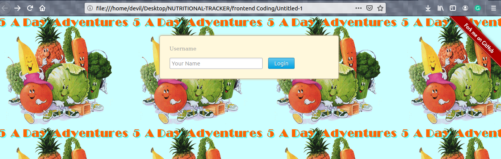

# Major_Project
Nutritional Tracker is modern product for those people who wants to complete their weekly required nutrition based on 5-a-day concept. This project will keep a full-on track of what exactly you have bought in your grocery every time and what you have to buy next time for your groceries.  In the project, code was extracted from the images clicked through Raspberry pi zero camera using google vision API and then based on that code data is analysed and result will be shown on HTML page which will be further stored on the cloud.

